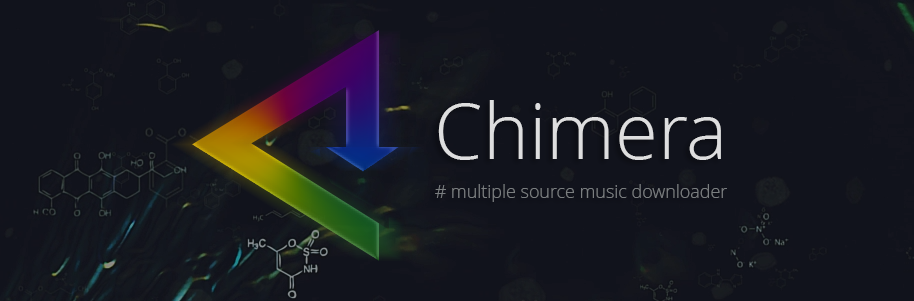

# chimera

multiple source music downloader  
Base code found here: [https://notabug.org/RemixDevs/demixed-dl](https://notabug.org/RemixDevs/demixed-dl)
***

## Usage

```
command                      | deezer   | tidal    | qobuz    | soundcloud | napster  | gpm      |  dtq    |  Spotify    
--------                     | -------- | -------- | -------- | --------   | -------- | -------- |-------- |----------
login                        |   Y      |   Y      |   Y      |   N        |   Y      |   Y      |   N     |   N  
grab track <id>              |   Y      |   Y      |   Y      |   Y        |   Y      |   Y      |   N     |   Y        
grab album <id>              |   Y      |   Y      |   Y      |   N        |   Y      |   Y      |   N     |   N        
grab playlist <id>           |   Y      |   Y      |   Y      |   Y        |   Y      |   Y      |   N     |   Y 
grab discography <artist id> |   Y      |   Y      |   Y      |   N        |   N      |   N      |   N     |   N 
grab saved                   |   Y      |   N      |   Y      |   N        |   N      |   N      |   N     |   Y  
search track [ENTER]         |   Y      |   Y      |   Y      |   N        |   Y      |   Y      |   Y     |   N   
search album [ENTER]         |   Y      |   Y      |   Y      |   N        |   Y      |   Y      |   Y     |   N   
search isrc <id>             |   Y      |   N      |   N      |   N        |   N      |   N      |   N     |   N   
show track <id>              |   Y      |   Y      |   Y      |   N        |   Y      |   Y      |   N     |   N   
show playlists               |   Y      |   Y      |   Y      |   Y        |   Y      |   Y      |   Y     |   Y    
track quality <id>           |   Y      |   Y      |   Y      |   N        |   Y      |   Y      |   N     |   N  
```

## Exclusive: Deezer
```
grab show <id> (podcast)
grab episode <id> (single episode from a podcast)
```


## Exclusive: Tidal
```
search video [ENTER]
grab video <id>
show video <id>
```

## Exclusive: Qobuz  
Download a complete label with it's ID.  
Label metadata gets cached under import/cache/label_[label_id].pkl.  
If that file is older than 4 days it gets deleted and recreated.  
Donwload could possibly crash, so I would advise you to change the album download settings, to `not overwrite` and `check_db to True`.  
Folder Path: `Music Root\<Label Name>\Albums`   
```
grab label <id>
```


**For a complete usage use the help page or look in the source code of `main.py` around line 420**


## FAQ
[https://notabug.org/Aesir/chimera/wiki/FAQ](https://notabug.org/Aesir/chimera/wiki/FAQ)


## API

Chimera has an api interface see: [https://notabug.org/Aesir/chimera-api-docs/src/master/api.md](https://notabug.org/Aesir/chimera-api-docs/src/master/api.md)

`python main.py --api`


## Audio Fingerpinting  
Feature like Shazam, for integration see: [https://notabug.org/Aesir/chimera/wiki/Audio+Fingerprinting](https://notabug.org/Aesir/chimera/wiki/Audio+Fingerprinting)

## Changelog  

**07-10-2019**
 - Concurrency added (multiple downlod workers)
 - new commands: `show status` and `show queue` 
 
When you grab an track, album or playlist with concurrency enabled you will not get any feedback. Use `show status` to monitor the progress.


**24-09-2019**  
 - New dependency install with `pip install -r requirements.txt` 
 - Faster decryption for deezer track
 - MQA support (again) for tidal  


**22-09-2019**
 - Playlists can now be downloaded as a compilation  
   Track NR in Tags changes to position  
   Album Tag changes to playlist name  
   Everything gets saved in a single playlist folder  


**05-09-2019**  
 - GooglePlayMusic added, uses gmusicapi which does not come
   with the requirements.txt file, because it has to many dependecies
   install it with `pip install gmusicapi`
   There is a config option to enable it, if you don't install gmusicapi
   everything else will still work
   Supports:
    - grab [track | album | playlist (use the public share token)]
    - search [track | album]
    - show playlists (shows user playlist, to download you still have to share it and use that token)


**01-09-2019**
 - Napster added, supports (M4A_320(AAC), M4A_192(AAC), M4A_64(AAC))
 - napster [login | grab track [id | url] | grab album [id | url] | grab playlist id | show playlists]  

Info: official track id starts with `tra.365693021` => just use the `365693021` without `tra.`

Usage  
```
grab track 365693021  
grab track https://app.napster.com/artist/eminem/album/recovery/track/cold-wind-blows
grab album https://app.napster.com/artist/eminem/album/recovery
show playlists
grab playlist mp.272317212
grab playlist pp.234543479
search track [new input for query]
search album [new input for query]
```

**31-08-2019**
 - Smart CLI Added, just input any url from deezer, tidal or qobuz  
   and it will start downloading (supported: track, album, playlist)  
   current active service does not matter.  

```
DEEZER -> https://www.deezer.com/track/737967312
grabbing The Man by Taylor Swift ID: 737967312
downloading: 23.0MB [00:05, 4.38MB/s]
decrypting: 100% 4/4 [00:03<00:00,  1.10it/s]

DEEZER -> https://play.qobuz.com/album/x88yammbh9rta
grabbing qobuz album Live and Loud
grabbing Radio Friendly Unit Shifter by Nirvana ID: 69299877
downloading: 35.2MB [00:02, 13.6MB/s]
```

**28-08-2019**
 - New Config System
 - use `setup chimera` to populate new config


## Install  

> Requires Python 3.7.4 (for audio fingerprinting 64bit is required)  

1. download python from here [https://www.python.org/downloads/](https://www.python.org/downloads/)  
2. download the latest source code from here [https://notabug.org/Aesir/chimera/archive/master.zip](https://notabug.org/Aesir/chimera/archive/master.zip)  
3. unzip and open a terminal in that folder  
4. not required but recommended to create a virtual env [https://docs.python-guide.org/dev/virtualenvs/](https://docs.python-guide.org/dev/virtualenvs/)  
   you can skip this if you only installed python for this project
5. install requirements with pip `pip install -r requirements.txt` 

Short video: [https://www.youtube.com/watch?v=wleo_QNKe_s&feature=youtu.be](https://www.youtube.com/watch?v=wleo_QNKe_s&feature=youtu.be)  
Thanks to Bas Curtiz for creating it.

***

## Start  
If you created an virtual env: `workon chimera`  
```
python main.py
```

## First Run
If the file `db\db.sqlite` does not exists, it gets created with default values. Furthermore your default webbrowser gets opened to [http://localhost:5000/configure](http://localhost:5000/configure) where you can configure chimera.

## Configure
To configure chimera after your initial run. You can use `setup chimera` if you are in the cli mode.

## Update  
After each new version, run this command to update the DB scheme:  
`python update.py`


## Resources used

 - [https://notabug.org/RemixDevs/demixed-dl](https://notabug.org/RemixDevs/demixed-dl)
 - [https://github.com/Sorrow446/Qo-DL](https://github.com/Sorrow446/Qo-DL)
 - [https://github.com/spencercharest/tidal-api](https://github.com/spencercharest/tidal-api)
 - [https://github.com/Qobuz/api-documentation](https://github.com/Qobuz/api-documentation)
 - [https://git.fuwafuwa.moe/FatKiwi](https://git.fuwafuwa.moe/FatKiwi)
 - [https://github.com/DashLt/Spoofbuz](https://github.com/DashLt/Spoofbuz)

## Disclaimer

 - Chimera was developed for educational and private use only.
 - Not intended for distibuting and pirating music!
 - I am not responsible for the usage of others.
 - It may be illegal to use this in your country, inform yourself!